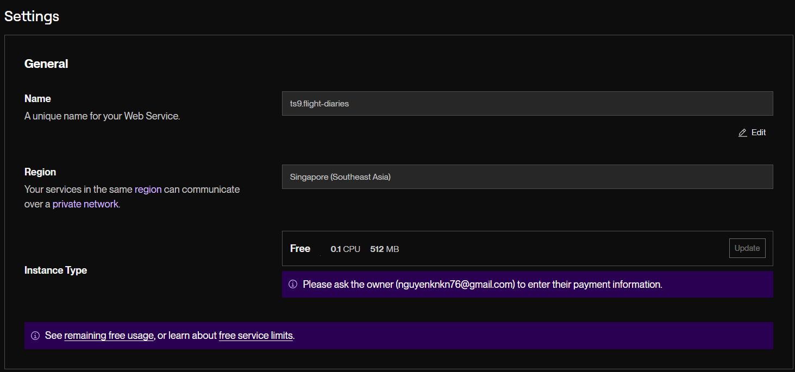
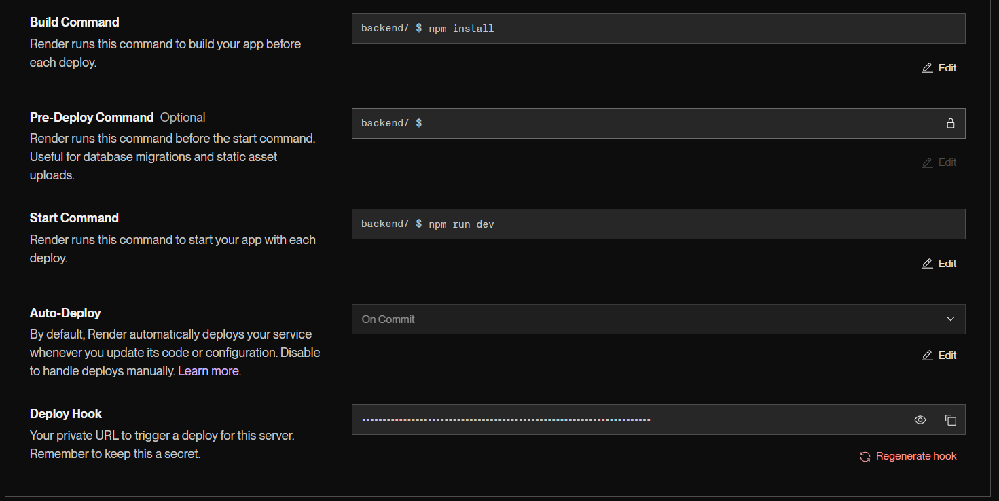
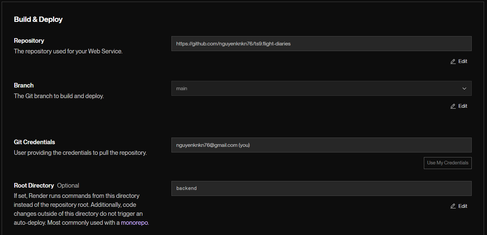
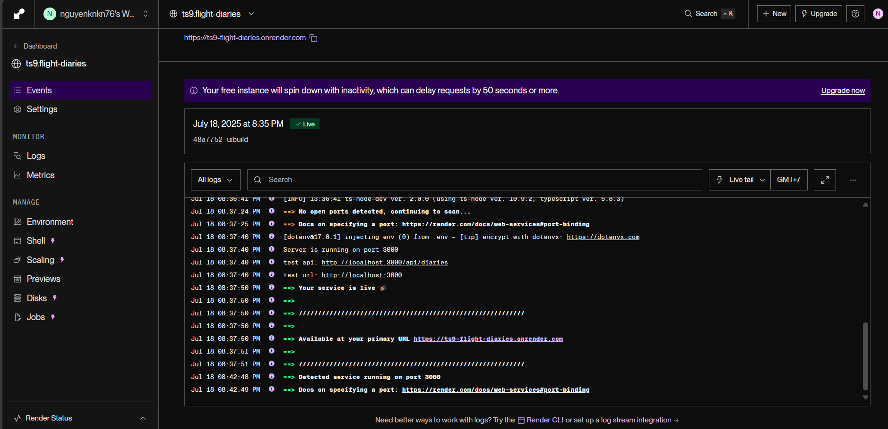
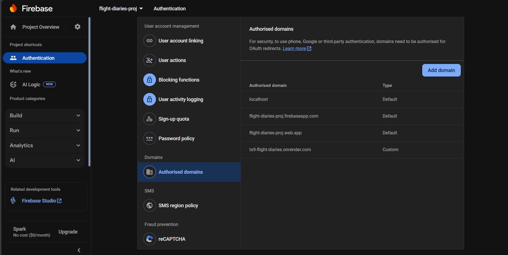

# Problems and How i solve it?
## requirement:
1. Tạo 1 trang web với ngôn ngữ bất kỳ, với tên miền bất kỳ và publish ra Internet bằng một hosting bất kỳ, kể cả free hosting (tức là có thể truy cập được từ mọi nơi, giả sử tên miền là https://abc.com)
2. Tạo 3 trang trên website đó như sau:
a. Trang chủ (homepage) có URL là https://abc.com, nội dung chỉ có 1 dòng static
text “Welcome” và 2 đường dẫn đến 2 trang (Page 1 và Page 2) bên dưới
b. Trang 1 có URL là https://abc.com/page1, nội dung là static text “Page 1”
c. Trang 2 có URL là https://abc.com/page2, nội dung là static text “Page 2”
3. Cấu hình:
a. Khi truy cập vào homepage và Trang 2 thì tất cả mọi người truy cập bình thường được từ Internet
b. Khi truy cập vào Trang 1 thì website sẽ xuất hiện promt/form/popup tùy ý để yêu cầu user đăng nhập bằng tài khoản Google (hoặc bất kỳ tài khoản social network nào như Facebook, Instagram, X, vv...). 
Đăng nhập thành công thì mới redirected lại về https://abc.com/page1 để xem được nội dung trang 1

## how i do it? 
1. solving problem method: deploy application to the internet (with [Render](https://render.com/))
- **Step 1: Create account && config Render**
  - Login with Github account
  - Create services && Connect application repo with Render
  - Config Render:



  - Deploy lastest commit and you have: `https://ts9-flight-diaries.onrender.com/`

- **Step 2: Build UI** 
  - declare middleware in `backend/src/index.ts`:
```ts
app.use(express.static('dist'))
```
  - setup `frontend/src/services/diary.service.ts` like this:
```ts
const baseUrl = "/api/diaries";
```
  - setup `scripts`
    - install lib `copyfiles`: `npm install --save-dev copyfiles` → run scripts in both Window and macOS/Linux
```json
// `frontend/package.json`
"scripts": {
  "copy": "npx copyfiles dist/**/* ../backend"
},

// `backend/package.json`
"scripts": {
  "build:ui": "cd ../frontend && npm run build && npx copyfiles dist/**/* ../backend",
  "deploy:full": "npm run build:ui && cd .. && git add . && git commit -m uibuild && git push origin main"
},
```
  - fix `proxy` in `vite.config.ts` and remove `cors`
```ts
// `frontend/vite.config.ts`
export default defineConfig({
  plugins: [react()],
  server: {
    proxy: {
      '/api':{
        target: `http://localhost:3000`,
        changeOrigin: true,
      }
    }
  }
})

// remove cors in `backend/src/index.ts`: with `npm remove cors` and comment code about cors in index.ts
```
→ **DONE**
→ Render: deploy lastest commit && access proj here ~ (`https://ts9-flight-diaries.onrender.com`)



2. Using `react-router-dom`
- **Step 1: config && setup**
  - install lib `react-router-dom`: `npm i react-router-dom`
- **Step 2: Implement**
```tsx
// App.tsx
import { BrowserRouter as Router, Routes, Route, Link } from 'react-router-dom';
import HomePage from './pages/HomePage';
import Page1 from './pages/Page1';
import Page2 from './pages/Page2';

function App() {
  return (
    <Router>
      <Routes>
        <Route path="/" element={<HomePage />} />
        <Route path="/page1" element={<Page1 />} />
        <Route path="/page2" element={<Page2 />} />
      </Routes>
    </Router>
  );
}
export default App;

// HomePage.tsx
import { Link } from 'react-router-dom';
function HomePage() {
  return (
    <div>
      <h1>Welcome</h1>
      <nav>
        <ul>
          <li><Link to="/page1">Go to Page 1</Link></li>
          <li><Link to="/page2">Go to Page 2</Link></li>
        </ul>
      </nav>
    </div>
  );
}
export default HomePage;

// Page1.tsx
// Page2.tsx
```

3. Using `Firebase` and `Redux`
- **Step 1: Create Firebase proj**
  - Access [Firebase console](https://console.firebase.google.com/)
  - Create new proj
  - Go to `Authentication` → `Sign-in methods` → enable google, fb,... etc
- **Step 2: Setup firebase for proj**
  - install lib `firebase`: `npm i firebase`
  - config firebase client in `frontend/src/configs/firebase.config.ts`
```ts
import { initializeApp } from 'firebase/app';
import { getAuth, GoogleAuthProvider } from 'firebase/auth';

const firebaseConfig = {
  apiKey: import.meta.env.VITE_FIREBASE_API_KEY,
  authDomain: import.meta.env.VITE_FIREBASE_AUTH_DOMAIN,
  projectId: import.meta.env.VITE_FIREBASE_PROJECT_ID,
  storageBucket: import.meta.env.VITE_FIREBASE_STORAGE_BUCKET,
  messagingSenderId: import.meta.env.VITE_FIREBASE_MESSAGING_SENDER_ID,
  appId: import.meta.env.VITE_FIREBASE_APP_ID,
  measurementId: import.meta.env.VITE_FIREBASE_MEASUREMENT_ID
};

const app = initializeApp(firebaseConfig);
export const auth = getAuth(app);
export const googleProvider = new GoogleAuthProvider();
```
> <!-- get env config value in `Proj settings` -->
  
```
VITE_FIREBASE_API_KEY=
VITE_FIREBASE_AUTH_DOMAIN=
VITE_FIREBASE_PROJECT_ID=
VITE_FIREBASE_STORAGE_BUCKET=
VITE_FIREBASE_MESSAGING_SENDER_ID=
VITE_FIREBASE_APP_ID=
VITE_FIREBASE_MEASUREMENT_ID=
```

  - Add domain: Go to **Authentiacation** → Settings → Authorized domains → Add domain


- **Step 3: Setup redux**
  - install lib redux toolkit && react redux: `npm install @reduxjs/toolkit react-redux`
  - create store:
```ts
// `frontend/src/store/store.ts`
import { configureStore } from '@reduxjs/toolkit';
import userReducer from './slices/userSlice';

export const store = configureStore({
  reducer: {
    user: userReducer,
  },
});

export type RootState = ReturnType<typeof store.getState>;
export type AppDispatch = typeof store.dispatch;

// `frontend/src/store/slices/userSlice.ts`
import { createSlice, PayloadAction } from '@reduxjs/toolkit';

interface UserState {
  uid: string;
  displayName: string;
  email: string;
  photoURL: string;
  isLoggedIn: boolean;
}

const initialState: UserState = {
  uid: '',
  displayName: '',
  email: '',
  photoURL: '',
  isLoggedIn: false,
};

const userSlice = createSlice({
  name: 'user',
  initialState,
  reducers: {
    login(state, action: PayloadAction<UserState>) {
      return { ...action.payload, isLoggedIn: true };
    },
    logout(state) {
      return { ...initialState };
    },
  },
});

export const { login, logout } = userSlice.actions;
export default userSlice.reducer;
```

- **Step 4: Implement**
```tsx
// `frontend/src/contexts/AuthContext.tsx`
import { createContext } from 'react';
import type { User } from 'firebase/auth';

export const AuthContext = createContext<{ user: User | null }>({ user: null });

// `frontend/src/hooks/useAuth.ts`
import { useContext } from 'react';
import { AuthContext } from '../contexts/AuthContext';

export const useAuth = () => useContext(AuthContext);

// `frontend/src/providers/AuthProvider.tsx`
import { useEffect, useState } from 'react';
import { onAuthStateChanged } from 'firebase/auth';
import { auth } from '../configs/firebase.config';
import { AuthContext } from '../contexts/AuthContext';

export const AuthProvider = ({ children }: { children: React.ReactNode }) => {
  const [user, setUser] = useState<import('firebase/auth').User | null>(null);

  useEffect(() => {
    const unsubscribe = onAuthStateChanged(auth, (user) => {
      setUser(user);
    });
    return unsubscribe;
  }, []);

  return <AuthContext.Provider value={{ user }}>{children}</AuthContext.Provider>;
};

// `frontend/src/pages/Page1.tsx`
import { useSelector } from "react-redux";
import type { RootState } from "../store/store";
import { Navigate } from "react-router-dom";

const Page1 = () => {
  const user = useSelector((state: RootState) => state.user);

  if (!user.isLoggedIn) {
    return <Navigate to="/login" />;
  }

  return (
    <div>
      <h1>Page 1 - Welcome, {user.displayName}!</h1>
      <p>Email: {user.email}</p>
      
    </div>
  );
};

export default Page1;

// `frontend/src/pages/LoginPage.tsx`
import { signInWithPopup } from 'firebase/auth';
import { auth, googleProvider } from '../configs/firebase.config';
import { useDispatch } from 'react-redux';
import { login } from '../store/slices/userSlice';
import { useNavigate } from 'react-router-dom';

const LoginPage = () => {
  const dispatch = useDispatch();
  const navigate = useNavigate();
  const handleLogin = async () => {
    try {
      const result = await signInWithPopup(auth, googleProvider);
      const user = result.user;
      // console.log(user);
      dispatch(login({
        uid: user.uid,
        displayName: user.displayName || '',
        email: user.email || '',
        photoURL: user.photoURL || '',
        isLoggedIn: true,
      }));
      navigate('/page1');
    } catch (error) {
      console.error('Login error:', error);
    }
  };

  return (
    <>
      some others way to login: ...
      <button onClick={handleLogin}>Login with Google</button>;
    </>
  ) 
};
export default LoginPage;

// `frontend/src/App.tsx`
import { BrowserRouter as Router, Routes, Route } from "react-router-dom";
import HomePage from "./pages/HomePage";
import Page1 from "./pages/Page1";
import Page2 from "./pages/Page2";
import LoginPage from "./pages/LoginPage";

const App = () => {
  return (
    <Router>
      <Routes>
        <Route path="/" element={<HomePage />} />
        <Route path="/page1" element={<Page1 />} />
        <Route path="/page2" element={<Page2 />} />
        <Route path="/login" element={<LoginPage />} />
      </Routes>
    </Router>
  )
}
export default App;

// `frontend/src/main.tsx`
import { StrictMode } from 'react'
import { createRoot } from 'react-dom/client'
import './index.css'
import App from './App.tsx'
import { Provider } from 'react-redux'
import { store } from './store/store.ts'

createRoot(document.getElementById('root')!).render(
  <Provider store={store}>
    <StrictMode>
      <App />
    </StrictMode>
  </Provider>,
)
```

**draf**
- flight-diaries
  - backend
  - frontend
    - dist

**file system (recommend)**
project/
├── src/
│   ├── configs/         # config local logic
│   ├── controllers/
│   ├── services/
│   └── index.ts
├── configs/             # config system and env
│   ├── app.config.json
│   └── logging.yaml
├── .env
├── package.json
